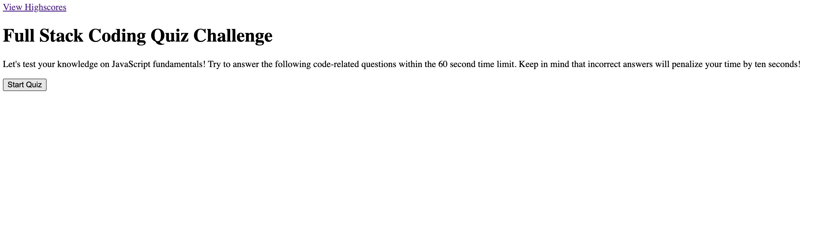
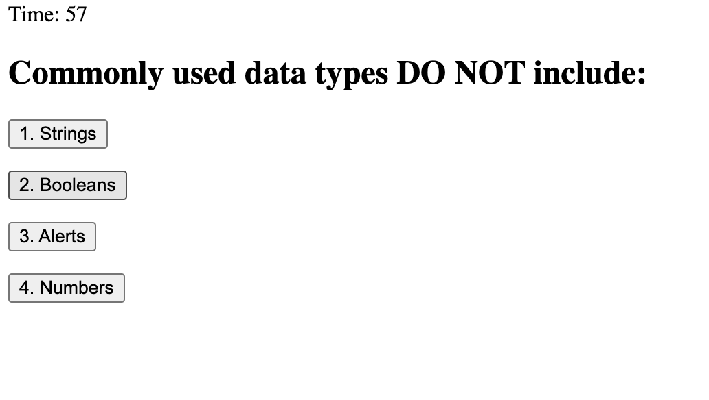
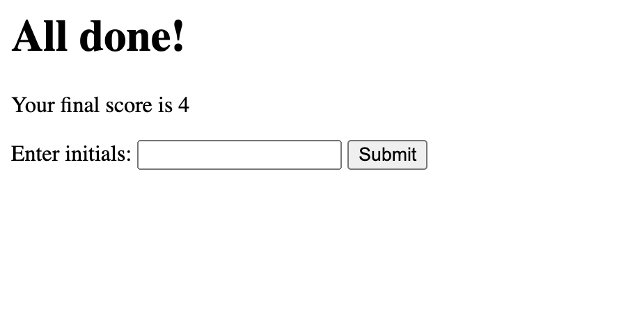
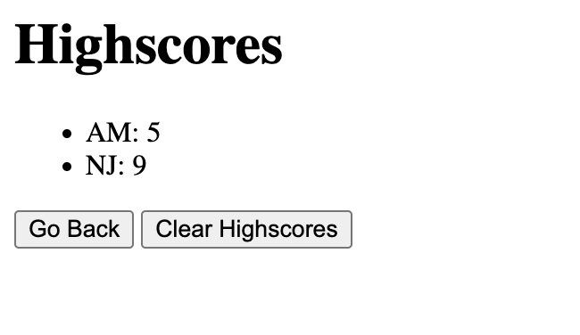

# Full Stack Coding Quiz

# Link to deployed application
https://alimomin7861.github.io/Full-Stack-Coding-Quiz/

# Visual Representation

# Overview 
The purpose of this project was to create a timed quiz on JavaScript fundamentals in which you could record your score at the end and compare your knowledge point to others. 
